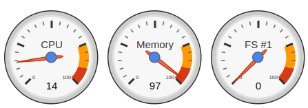
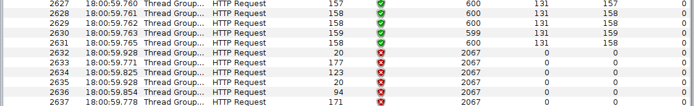

# PROFILING 001 - HEAP Limitada no composer (88m)

> Com dockerize para iniciar app no Docker

> MAX SEMI SPACE = 24

> 100 Threads

> RAMP UP 0.1s

> LOOP COUNT 1000000

> Resultado
* Throughput: 144 / 1002743 requests

* Memoria / CPU

* Queda
Capturar a saída para fins de análise : informou a queda por falta de memória?

# PROFILING 002 - HEAP Limitada no composer (64mb)

> Com dockerize para iniciar app no Docker

> MAX SEMI SPACE = 24

> 100 Threads

> RAMP UP 0.1s

> LOOP COUNT 1000000

> Resultado

* Log app inicio e fim
* Throughput

# PROFILING 003 - HEAP Limitada no composer (88mb)

> Com dockerize para iniciar app no Docker

> MAX SEMI SPACE = 24

> 100 Threads

> RAMP UP 0,1s

> LOOP COUNT 1000000

# TODO: PROFILING 004 - HEAP Limitada no composer (64mb)

> Com dockerize para iniciar app no Docker

> MAX SEMI SPACE = 48

> 100 Threads

> RAMP UP 10s

> LOOP COUNT 1000000

# TODO: HEAP Limitada no composer (128mb)

> Com dockerize para iniciar app no Docker

> MAX SEMI SPACE = 24

> 100 Threads

> RAMP UP 1s

> LOOP COUNT 1000000

# TODO PROFILING 005 (Sem express/mysql, Limite 88MB de Heap)

Sem express e sem MySQL
Retorno Dummy, apenas para passar no teste
Avaliar a carga de memória em container com limite de 88MB.

# TODO NETWORKING 001 (Conexaoes HTTP)

Testar os endpoints sync e assync e processamento bloquante de 5s.
Validar quantidade de conexoes nao bloquantes pelo netstat -an

# TODO NETWORKING 002 (Conexaoes HTTP)

Testar os endpoints com conexao reduzida no throughput e processamento bloquante de 5s.
Validar quantidade de conexoes nao bloquantes pelo netstat -an

# TODO Rest Api Sincrona

Implementar um wait na api rest (alem da consulta ao banco) para forçar a latencia subir e analisar.
Avaliar como será o comportamento do pool de conexoes do S.O com netstat x a contenção na thread principal do node.

# TODO Rest Api Sincrona

Implementar endpoint Prometheus na app para coleta de metricas de GC, latencia e throughput

# TODO: Balanceamento de carga

Implementar endpoint Prometheus
